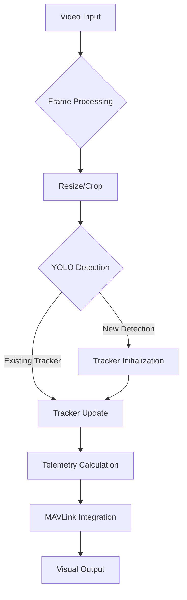

# Drone Detection and Tracking System

A real-time drone detection and tracking system using YOLO object detection and OpenCV tracking algorithms, with MAVLink integration for flight control systems.

## Features

- 🎯 YOLO-based object detection for drones
- 📡 Multiple tracker support (BOOSTING, MIL, KCF, CSRT, etc.)
- 📏 Real-time distance approximation
- 📐 Angle calculation relative to frame center
- 🎥 Video processing with configurable resolution
- ✈️ MAVLink integration for drone communication (commented out)
- ⚙️ Highly configurable through `config.py`

## Requirements

- Python 3.8+
- OpenCV 4.7+
- Ultralytics YOLO
- pymavlink (optional for flight control)

Install dependencies:

`pip3 install -r requirements.txt`

## Quick Start

1. Clone the repository
2. Configure `config.py`:
3. Run `main.py`

## Configuration Guide (`config.py`)

| Parameter               | Description                          | Default Value       |
|-------------------------|--------------------------------------|---------------------|
| `MODEL_PATH`            | Path to YOLO model                   | Required            |
| `VIDEO_PATH`            | Input video path                     | Required            |
| `TRACKER_TYPE`          | Tracking algorithm                   | "MOSSE"              |
| `DETECTION_INTERVAL`    | Frames between detections            | 30                  |
| `MAX_ALLOWED_RES`       | Maximum processing resolution        | 1280                |
| `CROP_CENTER`           | Enable center cropping               | False               |
| `CROP_CENTER_WIDTH`     | Crop width                           | 640                 |
| `CROP_CENTER_HEIGHT`    | Crop height                          | 640                 |
| `SAVE_OUTPUT_VIDEO`     | Save processed video                 | True                |
| `OUTPUT_PATH_TEMPLATE`  | Output video path format             | "./output/{...}.mp4"|

## System Architecture

